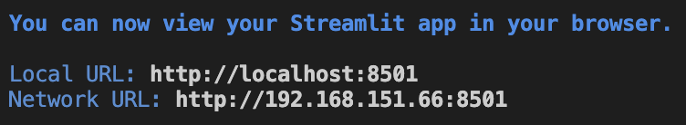

# 程序使用说明

> 作业要求：自编程序实现 RINEX o文件的读取，实现数据完整性分析、信噪比分析、载波相位周跳探测分析和多路径分析

## 1. 程序运行效果展示

### 1.1 运行环境

- Python 3.9.16
- 依赖库
  - numpy
  - pandas
  - matplotlib
  - streamlit
  - mpld3

### 1.2 步骤

1. 运行入口文件`main.py`，出现以下结果

将红框所示部分复制，在终端运行
初次运行要求输入Email，可以直接回车

2. 然后会出现如下结果，并自动在浏览器中显示界面


3. 运行成功后，出现以下界面


4. 导入RINEX观测值文件，本仓库提供的测试数据文件放在`Rinex`文件夹下

> **注意**：导入的文件一定只能是`Rinex`文件夹下的，不然路径会报错

5. 导入数据成功后，红框部分可以查看不同系统对应观测类型的数据


6. 点击侧边栏查看数据分析内容


7. 图片的交互性


## 2. `gnss.py`模块的使用

```Python
import gnss as gn

path = './Rinex/D045171B.23o'
gc = gn.GnssCal(path) # 调用gnss中的GnssCal类，继承自Rinex_o类
gps_data = gc.gc.getDataFrame('G')  #返回GPS系统的所有观测值数据组成的pandas表格

# gc 属性说明
# 1. 如果Rinex o文件中有记载观测的起始和结束时间
gc.first_obs  #起始观测时间
gc.last_obs   #结束观测时间
gc.obs_time   #观测持续的时间
gc.interval   #观测中的采样间隔

# 2. 观测值类型
gc.system     #返回o文件中观测到的卫星系统
gc.obs_type   #返回一个字典，键选'G','R','C','E'，目前只支持这四种系统
gc.obs_type['G']  #返回o文件中GPS系统的观测值类型

# 3. 观测值类型对应的观测值个数
gc.obs_sat_num    #返回观测到的卫星总个数
gc.obs_type_num   #返回一个字典，键可选'G','R','C','E'
gc.obs_type_num['G']  #返回o文件中观测到的GPS卫星prn和各种观测类型对应的数量

# gc 函数说明
# 1. 观测值数据获取函数
gc.getDataFrame(sys)  #返回sys(可选'G','R','C','E')系统的所有观测值数据组成的pandas表格
gc.getDataFrame('G')  #GPS系统的观测值数据表格

# 2. 完整性分析函数
gc.integrity()  #返回一个字典，键可选'G','C'，值是一个pandas表格，记录了不同频段上的数据完整率
integrity = gc.integrity()
integrity['G']  #GPS系统的完整性统计表

# 3. 周跳分析函数
gc.getLeap()  #返回一个字典，键可选'G','C'，值也是一个字典（键是卫星prn，值是pandas表格）
leap = gc.getLeap()
leap['G']['G01']  #GPS系统的G01卫星数据，包括历元，MW组合，周跳大小

# 4. 信噪比分析函数
gc.getSNR(sys)  #参数sys可选'G','C'，返回值是一个字典,键是卫星prn，值是（历元+频段信噪比）组成的表格
sgn = gc.getSNR('G')
sgn['G01']  #G01卫星的信噪比表

# 5. 多路径分析函数
gc.mutipath(sys)  #参数sys可选'G','C',返回值是一个字典，键是卫星prn，值是(历元+两个频段上的多路径值)组成的表格
mutipath = gc.mutipath('G')
mutipath['G01'] #G01卫星的多路径表
```

## 3. 程序实现原理说明

参看文件`gnss.py`

## 4. 界面的实现

1. 必要条件之一，导入`streamlit`库，用于将数据可视化到网页，使用简便。
2. 文件目录
   - `main.py`:界面入口文件
   - `pages`:其他页面的文件
3. RINEX o文件数据需放在`Rinex`文件夹下
4. `streamlit`的基本使用

```Python
import streamlit as st
st.write(dataframe) #展示表格
tab1, tab2,tab3 = st.tabs(['tab1','tab2','tab2']) #多标签组件
with st.sidebar:
  sys = st.radio("选择系统",('GPS系统','BDS系统'))  #侧边栏选择按钮
  prn = st.selectbox(
      '选择卫星prn号',
      options=list(mutipath.keys())
    ) #侧边栏多选框

ax = mutipath[prn].plot(y=["MP1","MP2"])
fig_html = mpld3.fig_to_html(ax.get_figure())
components.html(fig_html, height=600)   #绘制交互图，需要导入mpld3,components
```